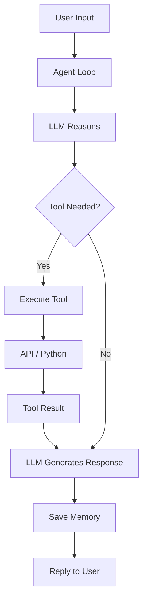

# 🤖 Multi-Tool AI Agent

A **production-inspired conversational AI agent** built using the **ReAct (Reasoning + Acting)** pattern. The agent understands natural language, selects the appropriate tool, executes real-time API calls, and returns accurate, structured responses while maintaining persistent conversation memory.

---

## ✨ Features

| Domain | Tools |
|--------|-------|
| Math | `calculator` |
| Health | `bmi_calculator`, `age_calculator` |
| Academics | `grade_calculator` |
| Weather | `get_weather`, `get_weather_by_coordinates` |
| Currency | `convert_currency`, `list_currencies`, `compare_currency` |
| Country Information | `get_country_info`, `search_countries_by_region` |
| Book Search | `search_books_by_title`, `search_books_by_author`, `get_book_by_isbn` |

**Total:** **14 tools across 7 domains**

---

# 🏗️ Architecture

```text
User
 │
 ▼
Agent Loop (ReAct)
 │
 ├── LLM (Nemotron 120B via OpenRouter)
 │         │
 │         └── Select Tool
 ▼
Tool Executor
 │
 ├── Python Function
 ├── External API
 └── Local Computation
 │
 ▼
Result → LLM → Natural Language Response
 │
 ▼
Conversation Memory (JSON)
```

---

## 🔄 Workflow



---

# 🚀 Agent Capabilities

## 🧮 Math
- Accurate arithmetic
- Large-number multiplication
- Division

Examples:
- `What is 1847293 × 6492?`
- `Divide 99 by 7`

## ❤️ Health
- BMI Calculator
- Age Calculator

Examples:
- `My weight is 70 kg and height is 175 cm`
- `I was born on 15 March 2004`

## 🎓 Academics
- Percentage
- Grade
- Remarks

## ☁️ Weather
- Current weather
- Coordinates
- Celsius/Fahrenheit

## 💱 Currency
- Live conversion
- Currency comparison
- List currencies

## 🌍 Country Information
- Capital
- Population
- Area
- Languages
- Currency
- Region
- Timezones
- Calling codes

## 📚 Book Search
- Search by title
- Search by author
- Search by ISBN

---

# 📁 Project Structure

```text
multi-tool-ai-agent/
│
├── main.py
├── tools.py
├── prompts.py
├── memory.py
├── memory.json
├── .env
├── requirements.txt
└── README.md
```

---

# 🛠 Tech Stack

| Category | Technology |
|----------|------------|
| Language | Python 3.10+ |
| LLM | Nemotron 3 Super 120B |
| Framework | ReAct Agent |
| APIs | OpenRouter, OpenWeatherMap, ExchangeRate API, RestCountries, Open Library |

---

# ⚙️ Setup

## 1. Clone

```bash
git clone https://github.com/yourusername/multi-tool-ai-agent.git

cd multi-tool-ai-agent
```

## 2. Install

```bash
pip install -r requirements.txt
```

or

```bash
pip install requests python-dotenv
```

## 3. Configure

Create `.env`

```env
OPENROUTER_API_KEY=your_key
OPENWEATHER_API_KEY=your_key
EXCHANGERATE_API_KEY=your_key
```

## 4. Run

```bash
python main.py
```

---

# 💬 Sample Interactions

### Weather

```text
You: What is the weather in Chennai?

Agent:
Temperature: 33°C
Humidity: 72%
Condition: Partly Cloudy
```

### Currency

```text
You:
Convert 1000 INR to USD

Agent:
1000 INR = 11.98 USD
```

### Country

```text
You:
Tell me about Germany

Agent:
Capital: Berlin
Currency: Euro
Population: 83M
```

### Book

```text
You:
Books by APJ Abdul Kalam

Agent:
• Wings of Fire
• Ignited Minds
```

---

# 🎯 Highlights

- ReAct Agent Architecture
- Multi-tool orchestration
- Tool schema design
- Persistent conversation memory
- Live API integrations
- Production-style modular codebase

---
